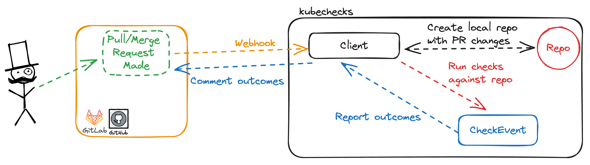

# kubechecks - Fearless Kubernetes App Updates

`kubechecks` allows users of Github and Gitlab to see exactly what their changes will affect on their current ArgoCD deployments, as well as automatically run various conformance test suites prior to merge.

## Pull/Merge Request driven checks

When using ArgoCD, it can be difficult to tell just how your Pull/Merge Request (PR/MR) will impact your live deployment. `kubechecks` was designed to address this problem; every time a new PR/MR is created, `kubechecks` will automatically determine what's changed and how it will impact your `main`/default branchs state, informing you of the details directly on the PR/MR. As a bonus, it also lints and checks your Kubernetes manifests to let you know ahead of time if something is outdated, invalid, or otherwise not good practice.

### How it works

This tool provides a server function that processes webhooks from Gitlab/Github, clones the repository at the `HEAD` SHA of the PR/MR, and runs various check suites, commenting the output of each check in a single comment on your PR/MR. `kubechecks` talks directly to ArgoCD to get the live state of your deployments to ensure that you have the most accurate information about how your changes will affect your production code.

### Architecture

`kubechecks` consists of a high level structures for communicating with your VCS provider of choice, representing a PR/MR internally, and running checks for that code; read more in [the docs](./docs/architecture.md)

## Installation

### Helm

See [Installation Docs](https://kubechecks.readthedocs.io/en/stable/usage/)

## Contributing

The [contributing](https://kubechecks.readthedocs.io/en/stable/contributing/) has everything you need to start working on `kubechecks`.

## Documentation

To learn more about `kubechecks` [go to the complete documentation](https://kubechecks.readthedocs.io/).

---

Made by SRE Team @ 
