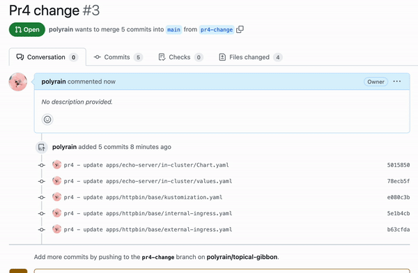
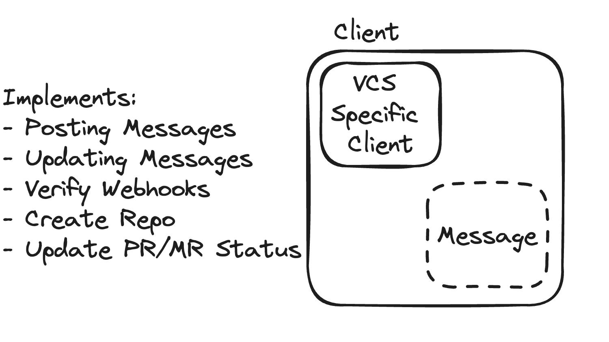
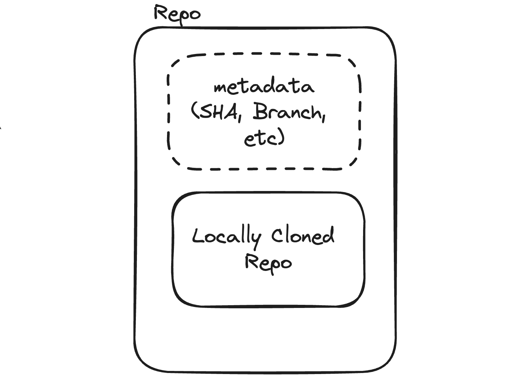
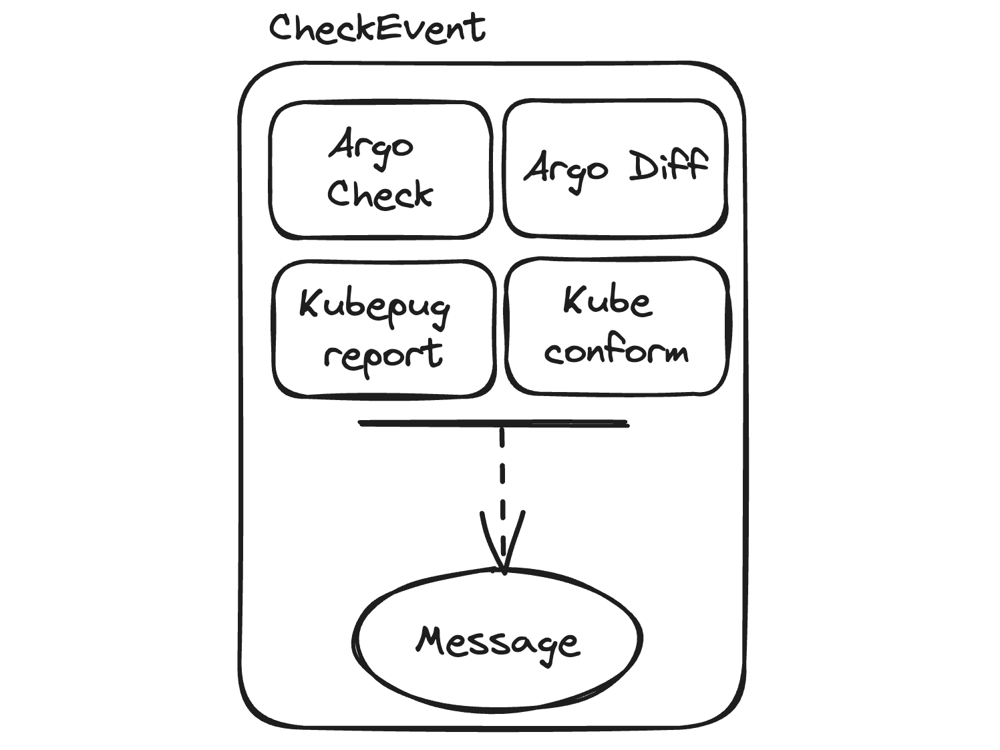
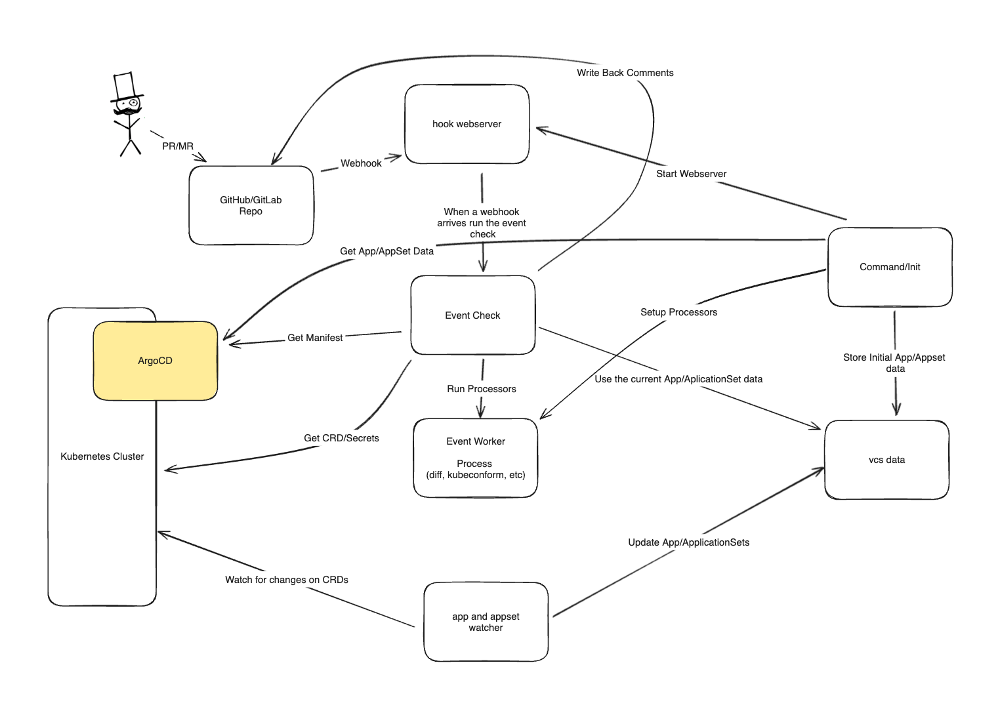

# Architecture

`kubechecks` is driven by webhook events from remote VCS providers (Github, Gitlab, etc), describing new commits/sets of changes (in the form of Pull/Merge Requests). These events are parsed by VCS specific `Client`s and cloned to a local `Repo`, which has all
the checks `kubechecks` runs made against it.

## Overview

Once `kubechecks` starts, it will listen on the configured webhook address for payload events. **You must register your remote repository (Github etc) to send PullRequest/MergeRequest events to this address**. Once this is configured, `kubechecks` will respond to new Pull/Merge (PR/MR) requests and begin generating various reports based on the requested changes to be merged into your main branch.

As each application is checked, a comment left on your PR/MR dynamically updates with the latest information; letting you see as soon as possible if something isn't quite right with your new code. Take a look below!

## Components

`kubechecks` at it's core is built upon three core ideas; a `Client`, representing the remote VCS provider (i.e. Github or Gitlab) which parses webhook events and interacts with remote Pull/Merge requests; a `CheckEvent`, representing a single run of `kubechecks` in it's entirety; and a `Repo`, representing a local git repository with the changes contained within the webhook event.

### Client

{: style="height:350px;display:block;margin:0 auto;"}

`Client`'s are the entrypoint for kickstarting the whole `kubechecks` process; a `Client` implements functions to enable communication to a remote VCS provider (through posting comments), validate webhooks and their payloads, and convert webhook payloads to the internal representation of a Git Repo. Currently, `kubechecks` has clients written and maintained for both Github and Gitlab; if you'd like to see a new platform supported, make a PR!

### Repo

{: style="height:350px;display:block;margin:0 auto;"}

`Repo`'s are an internal representation of a Pull/Merge Request, containing information such as the `HEAD` of the PR/MR branch, the base/target branch attempting to be merged into, and git specific metadata such as username/email. This information is then used to locally clone the repository at the specified SHA.

By abstracting the PR/MR in this way, `kubechecks` remains VCS provider agnostic, as the concrete `Client`'s are responsible for producing the `Repo` from their specific implementation. This design ensures that as long as a `Client` is configured to create a `Repo`, `kubechecks` will continue to work without concern.

### CheckEvent

{: style="height:350px;display:block;margin:0 auto;"}

The final piece of the puzzle is the `CheckEvent`; an internal structure that takes a `Client` and a `Repo` and begins running all configured checks. A `CheckEvent` first determines what applications within the repository have been affected by the PR/MR, and begins concurrently running the check suite against each affected application to generate a report for that app. As each application updates its report, the `CheckEvent` compiles all reports together and instructs the `Client` to update the PR/MR with a comment detailing the current progress; resulting in one comment per run of `kubechecks` with the latest information about that particular run. Whenever a new run of `kubechecks` is initiated, all previous comments are deleted to reduce clutter.

### Event Flows Diagram

{: style="height:350px;display:block;margin:0 auto;"}

This diagram illustrates the flow of events from the initial webhook trigger to the final report generation and comment update process.

