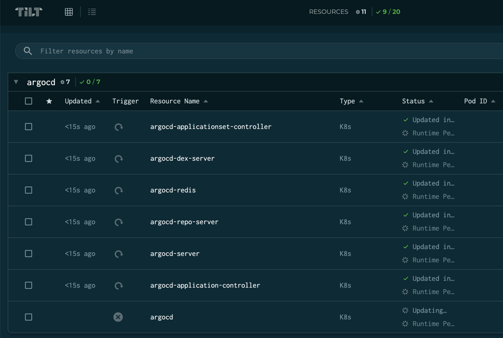
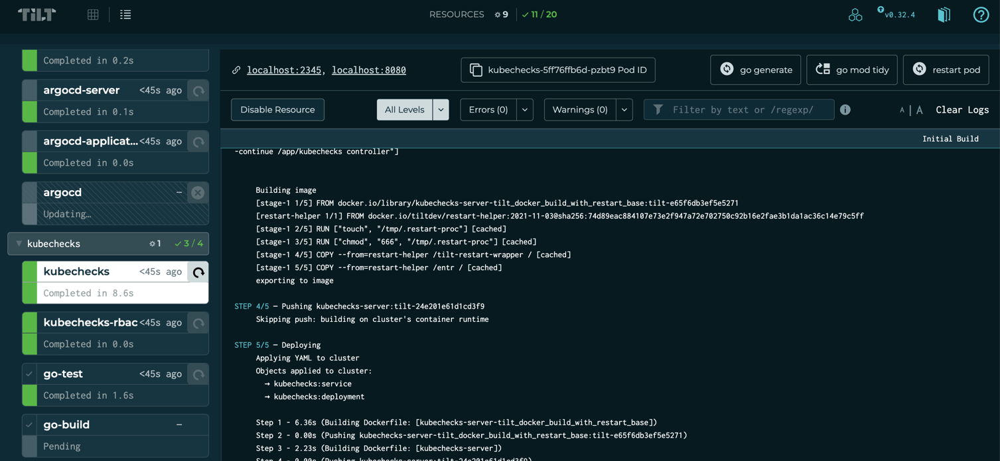

# Contributing to kubechecks

We're always looking for community contributions to `kubechecks`. The best way to get started is to create an issue. This can be for a bug, or for a new feature. This helps us gauge how many other users are impacted, or would benefit from a new feature.

## Issues

We use [Github Issues](https://github.com/zapier/kubechecks/issues) to track issues and features for this project.

## Contributor Agreement

We have decided to use [DCO](https://en.wikipedia.org/wiki/Developer_Certificate_of_Origin) to reduce the friction of contributing to `kubechecks`. To sign off on a commit you can use `-s` or `--signoff` when committing to append a [trailer](https://git-scm.com/docs/git-commit#Documentation/git-commit.txt--s).

If you forget to sign off on your last commit you can amend it using `git commit --amend --signoff`, or if there are multiple commits that need to be amended `git rebase --signoff HEAD~2` can be used replacing `HEAD~2` with the number of commits to go back. More information can be found in this [Stack Overflow](https://stackoverflow.com/questions/13043357/git-sign-off-previous-commits) post.

Other notable projects that use DCO:

* [Linux Kernel](https://developercertificate.org/)
* [Gitlab](https://about.gitlab.com/community/contribute/dco-cla/)
* [GCC](https://gcc.gnu.org/dco.html)

-------------

## Pull Request Process

1. You are welcome to submit a draft pull request for commentary or review before it is fully completed. Feel free to provide more information on the issue you're addressing or a link to a specific one to add more context.
2. When time permits `kubechecks`'s core team members will look over your contribution and either merge, or provide comments. It may take some time for us to respond. We kindly ask that you do not target specific team members. We may also reject a PR at this time with comments around why, and if we would reconsider it.
3. If we have requested changes, you can either make those changes or, if you disagree with the suggested changes, we can discuss it further in the pull request. This may be a multi-step process. It is the contributor's responsibility to address any changes requested. While reviewers are happy to give guidance, it is unsustainable for us to perform the coding work necessary to get a PR into a mergeable state.
4. Once all outstanding comments and checklist items have been addressed, your contribution will be merged! The core team takes care of updating the change log as required. It may be a bit before we cut a new release so your changes may not be available immediately.

### PR Checks

The following checks run when a PR is opened:

* Developer Certificate of Origin (DCO): This check is applied against every **commit**. If a single commit is not signed the check will fail. Please checkout our [Contributor Agreement](#contributor-agreement) for more details.
* Tests / Build: unit tests, go vet and docker build are executed on each PR. These must all pass for a PR to be considered mergeable.

-----------

## Developer Environment

### Tools / Accounts

* [Go 1.21](https://go.dev/)
* [Earthly](https://earthly.dev/)
* [Ngrok](https://ngrok.com/)
* [Tilt](https://tilt.dev/)
* [Gitlab](https://gitlab.com) / [Github](https://github.com) token
* [OpenAI](https://openai.com) token (Optional)
* [Kubernetes](https://kubernetes.io/)
  * [minikube](https://minikube.sigs.k8s.io/docs/)
  * [kind](https://kind.sigs.k8s.io/)
  * [Docker Desktop](https://docs.docker.com/desktop/kubernetes/)

Some of the above tools are not necessary if you're developing against an externally accessible kubernetes cluster. We leverage Ngrok for local testing in order to accept webhooks from Gitlab/Github.

### Tilt

[Tilt.dev](https://tilt.dev) is used to power the local development environment.
The `Tiltfile` defines all the resources required to build, run and test `kubechecks`.
It creates:

* Gitlab / Github repository with test files.
* Deploys ArgoCD and some demo applications to your kubernetes cluster.
* Deploys ngrok to provide an external accessible URL for Github/Gitlab to send webhooks to your local dev environment.
* Builds, tests and runs (with watch and hot restart) the `kubechecks` server in the local Kubernetes cluster.
* Delve live debugger is available for `kubechecks`.

To get started do the following:

* Copy the `.env.example` and set required values.

    ```console
    cp .env.example .env
    ```

* From the root directory of this repo:

    ```console
    tilt up
    ```

You should see output like:

    ```
    Tilt started on http://localhost:10350/
    v0.30.13, built 2022-12-05

    (space) to open the browser
    (s) to stream logs (--stream=true)
    (t) to open legacy terminal mode (--legacy=true)
    (ctrl-c) to exit

    ```

In the background Tilt has started building and deploying resources.

You should go ahead and press the space bar to open the Tilt web UI.

There are currently some circular dependencies in the local dev resources, so all resources may not come up cleanly on the first launch.



Click the Detailed view button at the top, and click the refresh button next to the `Tiltfile` resource to run another cycle.



#### Minikube

If you're using minikube with Tilt we recommend following this [guide](https://github.com/tilt-dev/ctlptl) to setup a local registry that Tilt can push to automatically. Without this Tilt will attempt to push up to Docker Hub by default.

### Code Changes

We use Earthly to simplify our CI/CD process with `kubechecks`. There's a thin wrapper around earthly that passes some common arguments in the root of the repo called `./earthly.sh` that should be used instead of calling earthly directly. This also simplifies testing changes locally before pushing them up to ensure your PR will pass all required checks. The best command to run is `./earthly.sh +test` this will pull all the required dependencies (including any new ones that you have added). It will then run [go vet](https://pkg.go.dev/cmd/vet), and if those pass it will run `go test` with race detection enabled. You can also always run these commands directly `go test -race ./...` will run all tests in the repo with race detection enabled. Please ensure that `./earthly +test` is passing before opening a PR.

### Documentation Changes

We use [mkdocs](https://www.mkdocs.org/) to build our docs locally. You can build these docs by running `mkdocs serve` from the root of the repository. It will also auto reload when any file is changed in that directory. By default you can view the docs under `http://localhost:8000`. Please confirm that any changes to documentation render correctly and that your changes display as expected.
